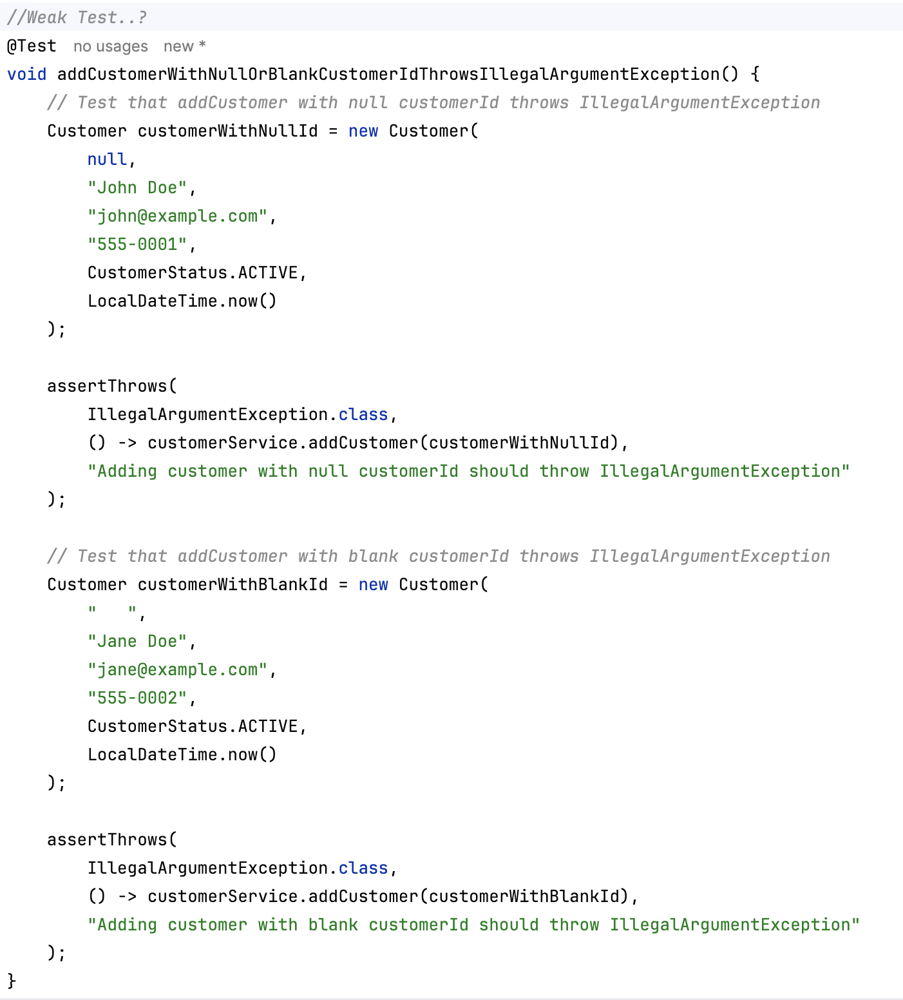

# AI test/refactor notes — Lab 11

## lab11-001 — generated exploratory test
- Accepted / rejected trivial assertion? 

- Notes: I accepted the weak test. I prompted it to give me one more test, to its discretion and it provided a reasonable test.
You can see the supposedly weak test below. 




## lab11-002 — CustomerServiceTest
- Notes: 

## lab11-003 — CustomerNotifier extract + Mockito
- Notes: I get warnings concerning Mockito, but generally the extraction and subsequent tests are well written.

## lab11-004 — coverage gaps / acceptance guidelines
- Copilot generate coverage gaps:
```text
Looking at the attached test files and CustomerService code, I can identify several gaps in test coverage:
Not Covered Behavior:
notifyCreated() is not called - The CustomerService.addCustomer() method has a TODO comment but doesn't actually call notifier.notifyCreated(). There's no test for this.
notifyCreated() notification on customer addition - CustomerNotifierMockTest only tests notifyStatusChange(), not notifyCreated() when a customer is added.
addCustomer() with null customer object - Input validation only tests null/blank customerId within the customer object, not a null customer object itself.
Default createdAt assignment - No explicit test verifying that when createdAt is null, it gets set to LocalDateTime.now().
Default status assignment - No explicit test verifying that when status is null, it gets set to CustomerStatus.PROSPECT.
Multiple customer storage and retrieval - No test that explicitly verifies the service can store multiple distinct customers and retrieve each correctly (though this is partially covered by existing tests).
findByCustomerId() returns empty Optional - No explicit test for the happy path that a non-existent customer returns an empty Optional (only indirectly tested via updateStatus() throwing exception).
Case sensitivity in customer ID lookup - Not tested (e.g., "CUS-1001" vs "cus-1001").
Most Critical Gap: The notifyCreated() method is incomplete - the code still has a TODO instead of calling the notifier. This should be implemented first, then a Mockito test should be added to verify it's called with the correct customerId and a non-null correlationId.
Would you like me to implement these missing tests and complete the notifyCreated() functionality?
```


# Discussion questions

### Difference between an exploratory Copilot-generated test and a deliberately designed suite?
The exploratory test is generated by Copilot to explore the behavior of the code, while a deliberately designed suite is created by developers with specific test cases and scenarios in mind to ensure comprehensive coverage and validation of the code's functionality.

### What makes an assertion “false confidence”?
A false confidence assertion is one that passes but does not actually verify the intended behavior or outcome, leading developers to believe the code is correct when it may not be.

### Why extract CustomerNotifier before mocking, instead of mocking concrete CustomerService?
CustomerNotifier is extracted before mocking to isolate the behavior of the notifier from the service, allowing for more focused testing and reducing dependencies on the concrete implementation of CustomerService.

### What is a code smell, and which Lab 10 smell is the clearest refactor candidate?
A code smell is an indication of potential problems in the code that may lead to maintainability issues or bugs. In Lab 10, the clearest refactor candidate could be a method that is too long or has too many responsibilities, indicating it should be broken down into smaller, more focused methods.

### Why is high coverage % not the same as meaningful coverage?
A high coverage percentage indicates that many lines of code are executed during tests, but it does not guarantee that all important scenarios and edge cases are tested. Meaningful coverage ensures that the tests validate the correct behavior and outcomes of the code.

### What regression risk exists when refactoring without a full suite—and how do today’s tests help?
Refactoring without a full suite of tests can introduce regression risks, as changes to the code may inadvertently break existing functionality. Today's tests help mitigate this risk by providing a safety net that verifies the behavior of the code before and after refactoring, ensuring that any changes do not introduce new bugs.

### When should you trust a Copilot extract-method vs verify manually?
Manual verification is necessary to ensure that the extracted method behaves as expected in all scenarios and does not introduce unintended side effects. A copilot extract-method can be trusted when it has been thoroughly reviewed and tested to confirm that it maintains the original functionality and adheres to best practices.

### What acceptance criteria should a reviewer apply before merging an AI-generated test or refactor?
A reviewer should ensure that the AI-generated test or refactor meets the following acceptance criteria:
- The test or refactor is clear, readable, and maintainable.
- It accurately tests or refactors the intended functionality without introducing new issues.
- It adheres to coding standards and best practices.


### Why keep JUnit/Mockito at test scope?
JUnit and Mockito are kept at test scope to ensure that they are only used for testing purposes and do not become part of the production code. This helps maintain a clean separation between the application code and the testing framework, reducing the risk of introducing unnecessary dependencies or complexity into the production environment.

### How does this preview set up Labs 17–18 without replacing them?
This preview sets up Labs 17–18 by providing a foundation of knowledge and skills that build upon the concepts introduced in the previous labs, ensuring a smooth transition and continued learning progression.


# Reflection Questions
### What made a test “meaningful” vs “false confidence” here?
A meaningful test accurately verifies the intended behavior of the code and covers important scenarios, while a false confidence test may pass without actually validating the correct functionality, leading to a false sense of security.

### How did extracting CustomerNotifier change testability?
Extracting CustomerNotifier improved testability by isolating its behavior from the rest of the code, allowing for more focused and independent testing. This separation made it easier to mock dependencies and verify the notifier's functionality without being affected by the implementation details of CustomerService.

### What would you tell a teammate who accepts every Copilot test unread?
I would advise them to carefully review each Copilot-generated test to ensure it accurately tests the intended functionality and does not introduce false confidence. It's important to understand the purpose of each test and verify that it aligns with the expected behavior of the code.

### Which refactor suggestion did you reject, and why?
I rejected the suggested implementation of a Mockito test for notifyCreated(Customer). This was one of the failure experiments, and instead of failing, it tried to rewrite the API to pass the test it would create.

### How does this preview connect to Labs 17–18?
This preview sets up Labs 17–18 by providing a foundation of knowledge and skills that build upon the concepts introduced in the previous labs, ensuring a smooth transition and continued learning progression.

### Which coverage gap is acceptable now, and what would change that later?


### How does this lab connect to the wider Northstar CRM platform (Weeks 2–6)?
This lab connects to the wider Northstar CRM platform by introducing concepts and practices that will be applied in later labs, such as testing, refactoring, and using AI tools. The skills learned here will be essential for developing and maintaining the CRM platform throughout Weeks 2–6.

### What is the cost of skipping before/after test runs on a refactor in a shared codebase?
The cost of skipping before/after test runs on a refactor in a shared codebase is that it increases the risk of introducing bugs or breaking existing functionality. Without running tests before and after the refactor, developers cannot verify that their changes have not negatively impacted the codebase, leading to potential issues for other team members and users.

### (Forward look) When Spring arrives, what about today’s notifier mock pattern stays valuable?
The notifier mock pattern remains valuable as it promotes loose coupling and makes testing easier by allowing developers to isolate and test specific components without relying on their dependencies.

# Security Questions

### Which test data is safe to commit, and why (CUS-1001 / CUS-1002)?
Test data that is safe to commit includes non-sensitive, anonymized, or fictional data such as CUS-1001 and CUS-1002. This ensures that no real customer information is exposed in the codebase, maintaining privacy and security while still allowing for effective testing.

### Where is human review enforced before AI tests/refactors merge?
Human review is enforced in the code review process before AI-generated tests or refactors are merged into the main codebase. This ensures that all changes are thoroughly evaluated for correctness, maintainability, and adherence to coding standards.

### What risk does an always-green trivial test create?
An always-green trivial test creates the risk of false confidence, where developers believe the code is working correctly when it may not be thoroughly tested or may have hidden issues.

### What is the risk of accepting a refactor without before/after suite runs?
The risk of accepting a refactor without before/after suite runs is that it may introduce regressions or break existing functionality without detection.

### Which values must never appear in tests or mocks?
Values that must never appear in tests or mocks include real customer data, API keys, passwords, or any other sensitive information.

### What would a tech lead audit for meaningful coverage?
A tech lead would audit for meaningful coverage by ensuring that tests cover important scenarios, edge cases, and business logic rather than just lines of code.

### How does mocking CustomerNotifier reduce coupling vs concrete implementations?
Mocking CustomerNotifier reduces coupling by allowing the test to focus on the behavior of the code under test without being dependent on the actual implementation of CustomerNotifier. This makes it easier to change or replace the notifier without affecting the tests, promoting flexibility and maintainability.

### How do you keep an audit trail of AI-suggested vs human-verified test code?
To keep an audit trail of AI-suggested vs human-verified test code, you can use version control systems to track changes and maintain logs of all modifications. Additionally, implementing a code review process that clearly indicates which parts were generated by AI and which were reviewed and approved by humans will help maintain transparency and accountability.