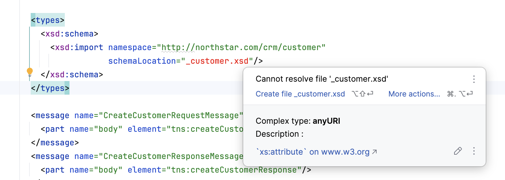
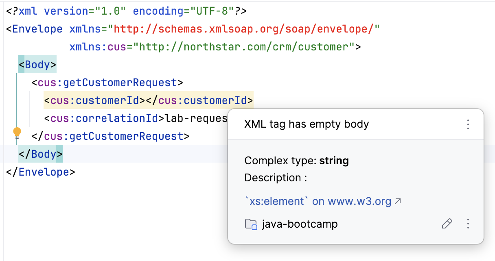

# SOAP design notes — Lab 13

## Failure Experiments
1. Rename/break schemaLocation

2. Invalid CustomerID in request

3. Compare Create vs Get retry safety
> On retry, CreateCustomer may create a duplicate; GetCustomer is idempotent.
4. Time how long to find soapAction in WSDL \
It took me about four and a half seconds to find the `soapAction` in the WSDL. I wrote the WSDL, 
so this may be a poor test for readability.

## Discussion Questions
1. Main data flow (partner → SOAP contract → future endpoint → CustomerService) \
> The main data flow is as follows. A partner sends a SOAP request to the SOAP contract, defined by the WSDL. 
The SOAP contract is then processed by a future endpoint, which uses the `CustomerService` to handle the request.
2. Trust boundary: schema validation vs service business rules \
 > Schema validation ensures that incomping SOAP requests conform to the structure and data types defined in the WSDL Scehma.
Service business rules enforce additional constraints and logic that may not be enforced by the schema alone. 
The trust boundary is the point where the system transitions from accepting external input to validating it according to their own rules and logic.

3. Success/failure contract for GetCustomer unknown IDs
> On success, GetCustomer returns a fully populated CustomerType with all fields (customerId, fullName, email, phone, status, createdAt). On failure—when a customer ID does not exist—the service returns a SOAP Fault with faultcode `soapenv:Client`, an error code of `CUSTOMER_NOT_FOUND`, and the unknown ID echoed in the faultstring. This contract ensures that partners can distinguish success from a missing customer without examining HTTP status codes or parsing ambiguous response structures.

4. Stable identity (CUS-1001) vs display fields
> The customerId (e.g., CUS-1001) is the stable identity that never changes, is assigned by the service on CreateCustomer, and serves as the primary key for all future Get and Update operations. Display fields (fullName, email, phone, status) are mutable and may change between calls. Partners must always use customerId for lookups and updates, never rely on full name or email as identifiers, because two customers may share a name and email addresses can be updated.

5. Retry/idempotency: Create vs Get vs Update semantics
> GetCustomer is idempotent—calling it multiple times with the same customerId returns the same customer state and causes no side effects, making it safe to retry on network timeouts. CreateCustomer is not idempotent—retrying a failed creation without an idempotency key risks creating duplicate customers. UpdateCustomer is idempotent within a request (applying the same patch multiple times reaches the same final state), but retrying old update requests risks undoing recent changes. Partners must implement idempotency keys or replay detection for Create and Update if true at-most-once semantics are required.

6. Static WSDL files vs generating WSDL only at runtime
> Hosting a static WSDL file in version control (as Lab 13 does) ensures that partners can review and cache the contract without invoking a live endpoint. It simplifies offline contract documentation, onboarding, and mock testing. Generating WSDL only at runtime couples the contract to server startup and requires partners to contact a live endpoint to discover the service, which complicates dev/test environments. For a stable contract, static WSDL is preferred; Lab 24 will reference this same static file at runtime.

7. Correlation header/field for support (lab-request-001)
> The optional correlationId field (in requests for all three operations) allows partners to tag each SOAP call with a unique identifier for tracing and support purposes. When a fault occurs—such as CUSTOMER_NOT_FOUND—the service echoes the correlationId in the fault response so support teams can map customer tickets to specific API calls in logs. This field is not validated by the schema and does not affect business logic; its purpose is purely operational correlation.

8. Two instances serving the same WSDL version—what must stay identical?
> The WSDL binding, portType names, operation names (CreateCustomer, UpdateCustomer, GetCustomer), soapAction URIs, and the XSD element/type definitions for request and response messages must remain identical across instances. Differences in these elements break partner clients that have cached or hard-coded the contract. The service location URL and implementation details (database, internal error messages beyond the defined Fault structure) may differ, but the externally visible contract must be synchronized via versioning and deployment coordination.

9. Why document/literal over RPC/encoded for this lab?
> Document/literal style (used here) sends XML instances that conform directly to XSD elements, making the SOAP message human-readable and schema-validatable. RPC/encoded wraps procedure calls and parameters in a more code-oriented fashion and encodes type information in the message itself, adding verbosity and complicating schema validation. For a contract-first design emphasizing stability and readability, document/literal is the modern standard. It aligns with REST-like thinking where the body is a document, not a remote procedure call.

10. What must not change between Lab 13 and Lab 24 without a version bump?
> The WSDL file name, namespace (http://northstar.com/crm/customer), operation names, message element names, XSD types, and soapAction URIs must not change. These are the public contract that Lab 13 freezes and Lab 24 implements behind a live endpoint. If Lab 24 adds a new operation or renames a field, it must increment the namespace version (e.g., /customer/v2) or introduce a new WSDL file. Breaking changes without a version bump cause existing partner clients to fail at runtime.

## Security Review Questions
1. Which SOAP inputs are untrusted (body/header fields)?
> All SOAP body fields—customerId, fullName, email, phone, status, and correlationId—are untrusted because they originate from external partners. SOAP headers (not present in this contract yet) would also be untrusted. The assumption is that partners may send malformed data, oversized strings, invalid enum values, or SQL injection payloads. Only the XSD schema validation is applied at the WSDL boundary; deeper validation (e.g., email format, phone length, name profanity) happens in service business rules.

2. Where will authn/authz/validation be enforced (schema + future WS-Security / service rules)?
> Schema validation (XSD) enforces structure and type constraints at the WSDL layer, catching malformed requests early. WS-Security (to be added in future labs) will enforce authentication (e.g., X.509 certificates, SAML tokens) and basic transport-level integrity. Service business rules in Lab 24 will enforce authorization (does this partner have permission to create customers?) and domain constraints (is customerId already in use? is email format acceptable?). The trust boundary shifts from schema to WS-Security to service rules as the request flows deeper.

3. Which values are sensitive—keep samples fictional?
> All customer data—fullName, email, phone, and status—is sensitive personally identifiable information (PII). Samples must use fictional names (Amina Khan), fake email addresses (@example.com), and anonymized phone numbers (+1-555-0101). The customerId (CUS-1001) and correlationId (lab-request-001) are non-sensitive identifiers suitable for examples. In production, the service must enforce transport-layer encryption (HTTPS/TLS), access controls, and audit logging for all customer queries.

4. What can be retried safely (Get yes; Create only with idempotency design)?
> GetCustomer can be retried safely at any time because it is a read-only query with no side effects. CreateCustomer can cause duplicate customers if retried without an idempotency key (a unique ID issued by the partner and stored by the service). UpdateCustomer can be retried if the update is truly idempotent (same patch applied twice reaches the same state), but retrying after a network failure risks overwriting a newer update made by another process. Partners must coordinate retry strategies with the service team or implement idempotency tokens in request/response.

5. What happens after failure (Fault response; no half-written customer in samples)?
> On failure (e.g., CUSTOMER_NOT_FOUND, validation error, or service exception), the service returns a SOAP Fault in the Body, not an HTTP 500 error. The Fault includes a faultcode, faultstring, and optional detail. Critically, no partial or half-written state is persisted—CreateCustomer fails entirely and creates no customer, UpdateCustomer fails entirely and leaves the customer unchanged. This atomicity must be guaranteed by the service implementation (e.g., database transaction), not by SOAP itself. Samples show successful responses and clean faults, not intermediate states.

6. What would ops monitor later (fault rates, latency)?
> Operations teams will monitor fault rate (percentage of requests returning Fault vs. Success), latency (time from partner request receipt to response), and error code distribution (how many CUSTOMER_NOT_FOUND vs. CUSTOMER_VALIDATION_ERROR). They will correlate faults with correlationId to map API calls to customer support tickets. They will alert on latency > 2s (SLA breach), fault rate spike (> 5%), and repeated errors from a single partner IP. Logs will include request size, response size, partner identity, and operation name for billing and troubleshooting.

7. Which local default is unacceptable in production (http:// placeholder, no auth)?
> The service location in the WSDL (http://localhost:8080/ws) is a clear HTTP placeholder with no encryption or authentication. In production, this must change to an HTTPS URL (e.g., https://api.northstar.com/ws) protected by TLS/SSL. There is currently no WS-Security or API key validation. Before going live, the service must enforce HTTPS-only, require authentication (X.509 cert, OAuth token, API key), and rate-limit partners to prevent abuse. Running HTTP without auth in production exposes customer data to eavesdropping and unauthorized access.

8. How are contracts versioned (namespace / WSDL version strategy)?
> The contract is versioned through the targetNamespace (http://northstar.com/crm/customer). If breaking changes are needed later (e.g., a new required field), the namespace increments to /customer/v2, and a new WSDL file is created. Clients can support both /customer and /customer/v2 endpoints in parallel, allowing gradual migration. The WSDL file name itself (CustomerService.wsdl) does not change, but the file is versioned in Git with clear tags and release notes. This namespace-based versioning allows multiple contract versions to coexist and lets partners choose when to upgrade.

## Reflection Questions
1. Which design decision most affected partner usability?
> The choice of static WSDL files hosted in Git alongside samples had the most impact. Partners could clone the repository, review the contract offline, and test with mock SOAP clients before any live server existed. This front-loaded clarity and reduced misalignment when Lab 24 went live. If the contract were generated dynamically or hidden behind a firewall, partners would have had to ask for access or reverse-engineer the API through trial and error.

2. Which failure was hardest to diagnose (namespace vs element name)?
> Namespace mismatches (targetNamespace in XSD vs. xmlns:tns in WSDL) were harder to diagnose than element name typos. An element name error produces an immediate schema validation failure with a clear XPath. A namespace mismatch silently fails to resolve type definitions, leading to cryptic "element not found" errors during WSDL parsing. The IDE highlights element names but not namespace URIs in many tools, so debugging required careful line-by-line comparison of xmlns declarations.

3. What evidence proves the contract is implementable in Lab 24?
> The sample XML files (success and fault responses) serve as executable proof. They are well-formed and schema-valid, demonstrating that the XSD and WSDL can actually produce valid messages. The presence of concrete examples for all three operations (Create, Get, Update) and both success and error paths proves the contract covers the intended use cases. A Java SOAP framework can parse and generate these samples directly from the WSDL, confirming technical implementability.

4. What breaks first at ten times the field count without versioning?
> Client code generation. Many SOAP IDEs (e.g., wsimport, Maven plugins) generate Java POJOs from the WSDL. If the contract doubles or triples in field count without a namespace version change, old clients continue to use the stale generated classes, causing field mismatch and silent data loss. Partners would not immediately notice because the message still parses; they would only detect the issue when comparing field values. Versioning forces a clean namespace cutover that signals "regenerate your stubs."

5. Which concern should move to shared infrastructure (WSDL hosting, WS-Security)?
> WSDL hosting should move to a shared, versioned content delivery network or artifact repository (e.g., Maven Central, Docker registry, or a dedicated contract server). This centralizes contract governance and ensures all instances and partners fetch the same version. WS-Security (keystores, certificate validation, SAML token issuance) should move to a shared PKI or identity provider (Okta, Active Directory) so that authentication logic is not duplicated across service instances and can be audited centrally.

6. What must change before real customer data is used?
> The placeholder service URL (http://localhost:8080/ws) must be replaced with a production HTTPS URL. Authentication and authorization must be implemented (no anonymous requests). Encryption at rest (for stored customer data) and in transit (TLS) must be enforced. Audit logging must record who accessed which customer records and when. Rate limiting and DDoS protection must be deployed. A data retention and deletion policy must be in place. Compliance reviews (GDPR, SOC 2, etc.) must clear the system for handling PII. Only then should sample data be replaced with real customer records.

7. How does this lab connect to Labs 8–12 domain work and Lab 24 SOAP hosting?
> Labs 8–12 built a domain model (Customer, Account, Transaction) with business logic, persistence, and analytics. Lab 13 wraps that domain in a SOAP contract, defining how external partners will interact with it. Lab 24 hosts this SOAP contract as a live service, exposing the domain logic via SOAP endpoints. The WSDL and XSD created here become the source of truth; the service implementation in Lab 24 must faithfully implement every operation and error code defined in the contract. This progression from domain → contract → hosting ensures API-first thinking.

8. What metric or log field matters most once the endpoint is live?
> The correlationId is the most critical log field. It links incoming requests to support tickets, fault responses, and internal logs. When a customer reports "my customer record disappeared," support can search logs by correlationId and reconstruct the exact sequence of CreateCustomer → UpdateCustomer → failure. Without correlationId, faults are orphaned from their source context. Latency is the second-most-critical metric; it affects partner retry logic and user experience, and can signal database contention or infrastructure problems.

9. (Forward look) If REST arrives later, what from this SOAP contract should stay conceptually identical?
> The domain model (CustomerType with customerId, fullName, email, phone, status, createdAt) should remain identical. The three operations (Create, Get, Update) should map to REST POST, GET, PUT semantics. The stable identity (customerId) should stay as the resource key (/customers/CUS-1001). Error codes and fault semantics should translate to HTTP status codes and response bodies. The correlationId concept should become a request/response header. The namespace (http://northstar.com/crm/customer) should become a REST resource path prefix. The contract versioning via namespace should become REST API versioning (/v1/customers vs. /v2/customers). Conceptually, the domain and operations are transport-agnostic; only the wire format changes.
