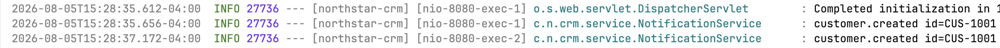

# Lab 22 — Dependency graph

## Bean edges (fill in)

- `CrmApplication` scans `com.northstar.crm`
- `CustomerController` → `CustomerService`
- `CustomerService` → `CustomerRepository` / `InMemoryCustomerRepository`
- `CustomerService` → `NotificationService`

## Fixtures

- `CUS-1001` Amina Khan ACTIVE
- `CUS-1002` Ravi Singh PROSPECT
- Correlation: `lab-request-001`

## Why constructor injection

TODO: 2–3 sentences on why constructor injection beats field `@Autowired` for CRM tests.

For CRM tests, constructor injection is better as it enforces explicit dependencies. 
These explicit dependencies make the code easier to test and maintain, as well as easier to test in isolation.
If the `@Autowired` annotation is used, it may inject dependencies, making it harder to test the class in isolation.

# Failure Experiments

1. Comment out `@Repository`

When `@Repository` is commented out, there was no repository bean found, and the application failed to start.

2. Invalid Create Payload
I could not get this to fail unless I sent a request to the wrong endpoint. Sometimes customers weren't created if there was no body to the request.
But I was never returned a 400 error, and the application never handled validation.

3. Repeat create CUS-1001

As shown in the information logs, no errors were thrown and the customer seems to have been overwritten.
I need to bring in work from previous labs for validation on creation, and to implement better tests.
4. Delay NotificationService

The system waits for the delay in the notification service, making this a blocking request. Request handlers should be 
asynchronous such that the request is not blocking. The notification service should either be asyncrhonous or decoupled from requests, as the logging occurs on the main thread, and not a separate coroutine. 

5. Temporarily new repo inside service	
Since the new repository had to be the `InMemoryCustomerRepository`, `CustomerRepository` is abstract, the tests and application did not break.
If the new repository was a different implementation of `CustomerRepository`, the application would have failed to start, as there would be multiple beans of type `CustomerRepository` and Spring would not know which one to inject.
Moreover, if the something besides `CustomerService` was using the new repository, the tests and application should fail since there are two repositories, out of sync with each other.

# Reflection Questions
1. Which design decision most affected correctness (constructor vs field injection)?
The constructor injection was the most impactful design decision. It fundamentally altered the design of the application,
decoupled dependencies for easier testing and maintenance. 

2. What evidence proves the graph works (unit + IT + curls)?
When running the applications, curling the endpoints returned the expected results. This showed the graph 
worked as intended.

3. Which failure was hardest to diagnose (scan issues, missing beans)?
Since I used the starter code, and not my previous project. The validation issues were the hardest to diagnose. 
The requests came back without error, despite being invalid and I had to dig through the code to find out why.