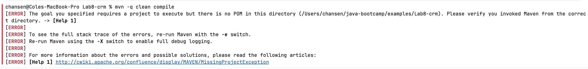
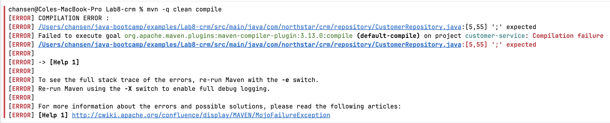
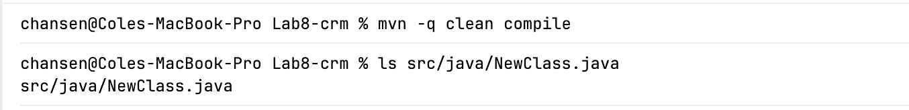

## Experiment 1

Rename `pom.xml` temporarily; `run mvn compile`

## Experiment 2

Temporarily import `com.northstar.crm.controller.CustomerController`
inside `CustomerRepository`

## Experiment 3
I created a `.java` file in `src/`. I then compiled. The compilation ran fine, but maven did not compile the `NewClass.java` file.

