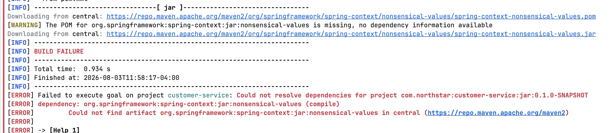
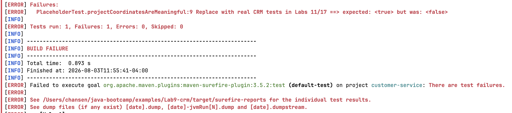
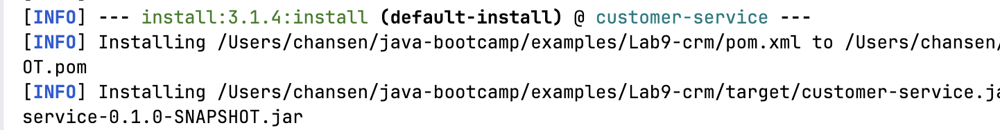
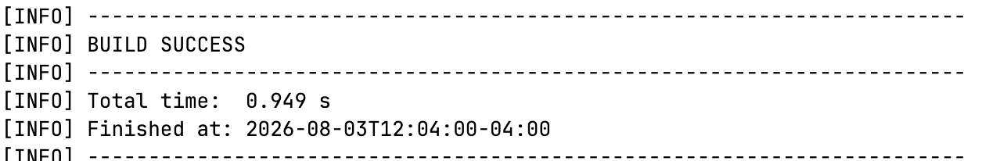
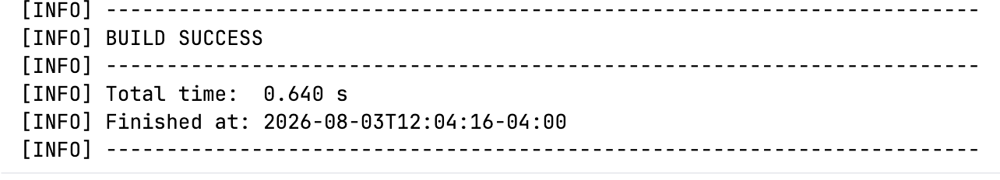
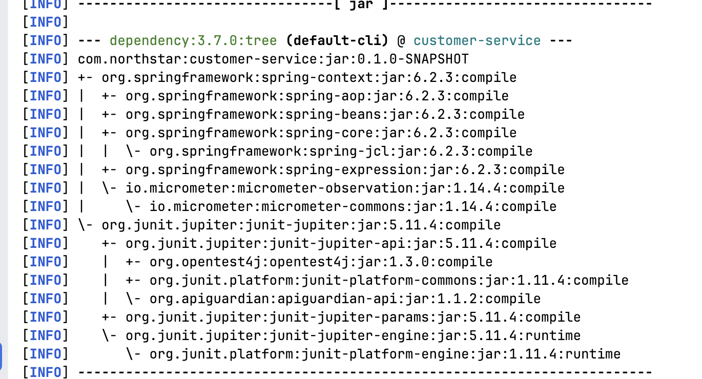

# Failure Experiments

## Experiment 1:
Set spring.version to nonsense; mvn compile

## Experiment 2: 
Change PlaceholderTest to assertTrue(false); mvn test / mvn verify

## Experiment 3: 
Run mvn install twice

This installation rewrites over the previous installation.

## Experiment 4:
Compare cold vs warm mvn -B verify wall-clock

The first verify took almost a full second. 

The second verify was about 40% faster.

## Experiment 5:
Remove <scope>test</scope> from JUnit temporarily; re-tree	

