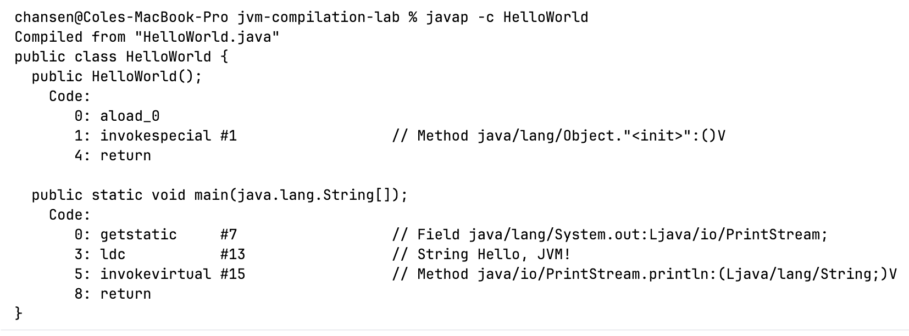
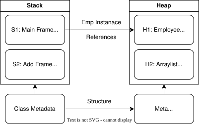
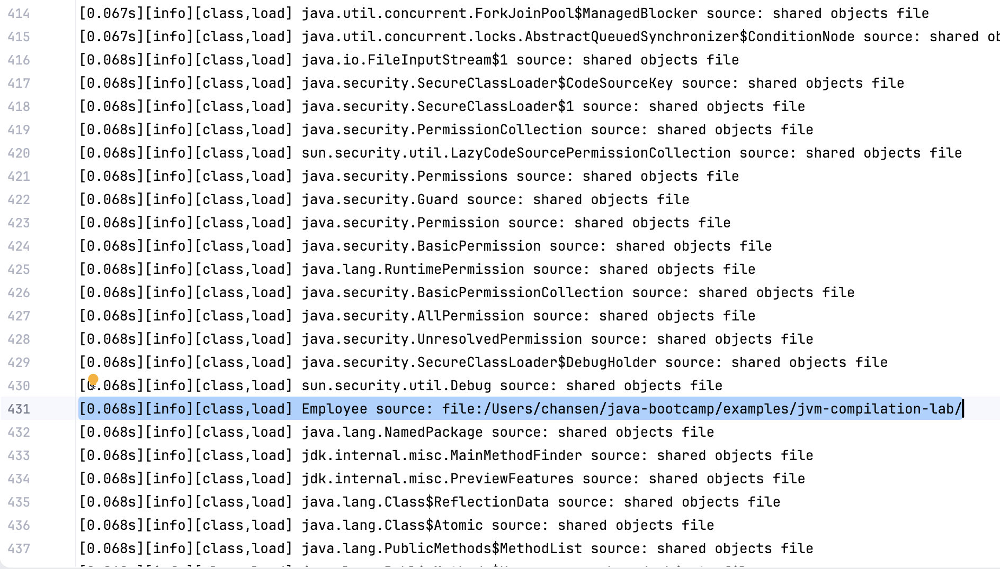
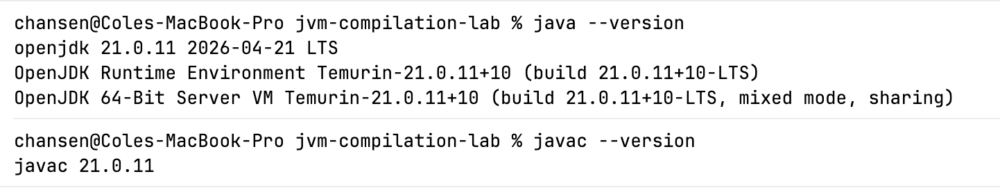
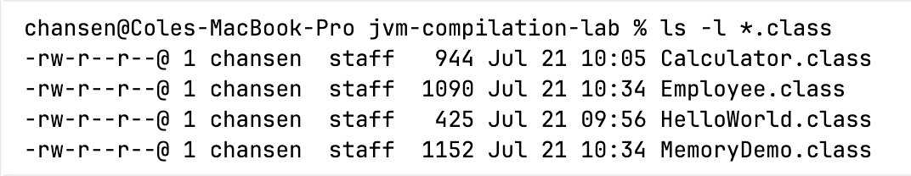
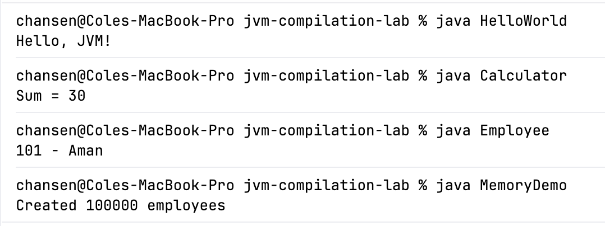
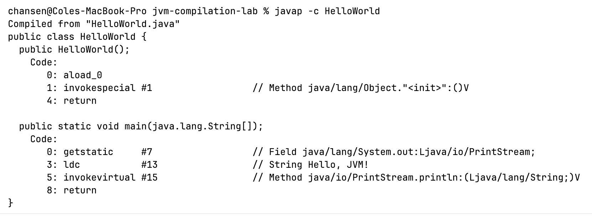
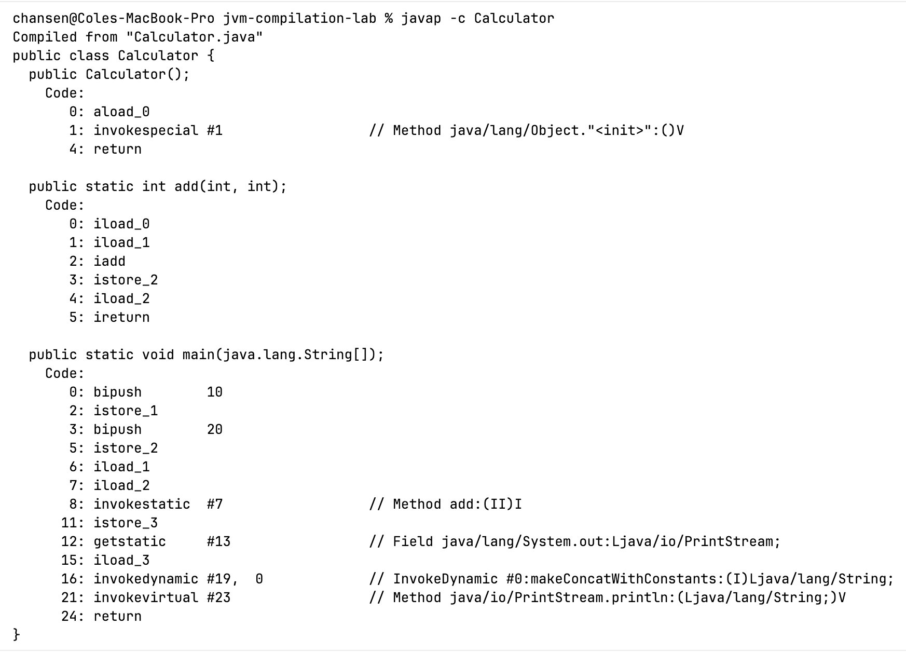

# Lab 1
This lab focuses on the jvm and compilation 

## Step 3
What is the difference between `HelloWorld.java` and `HelloWorld.class`? 

`HelloWorld.java` is our source code. This file defines the `HelloWorld` object and it's behavior. 
This file is then compiled using `javac`, which outputs a class file: `HelloWorld.class`. 
A class file is machine agnostic bytecode; it can run on any machine with `JVM` installed.

## Step 4

## Step 7, Flowchart

## Step 8

## Step 10
size_t InitialHeapSize   = 536870912  \
size_t MaxHeapSize       = 8589934592 \
size_t SoftMaxHeapSize   = 8589934592 \
bool UseG1GC             = true 

# Deliverables
Here I am going through and including all deliverables as outlines in the lab 1 guide.

## Screenshots

For the class loading output, please see `notes/classload-employee.txt`

Print flags are shown above in step 10. 

## Short Answers

### What does javac do?
`javac` compiles a `.java` file into bytecode. 

### What is bytecode?
Bytecode is machine agnostic aseembly instructions, run by the JVM. They are the result of the compilation of a `.java` file.

### Why is bytecode platform-independent?
Bytecode is platform independent because the compiler builds machine code for the JVM. Since the JVM, java virtual machine, handles the bytecode, it is considered platform independent.

### What is the role of the JVM?
The JVM is responsible for verifying and running bytecode.

### Where are objects stored?
Objects are stored in the heap. Their metadata is stored in the stack.

### Where are method calls / frames stored?
Method calls are stored in the stack.

### What happens when a class is loaded?
During the loading phase in the class loading lifecycle, the JVM locates the .class file, reads the bytecode and creates the class object.
(slide 63).
